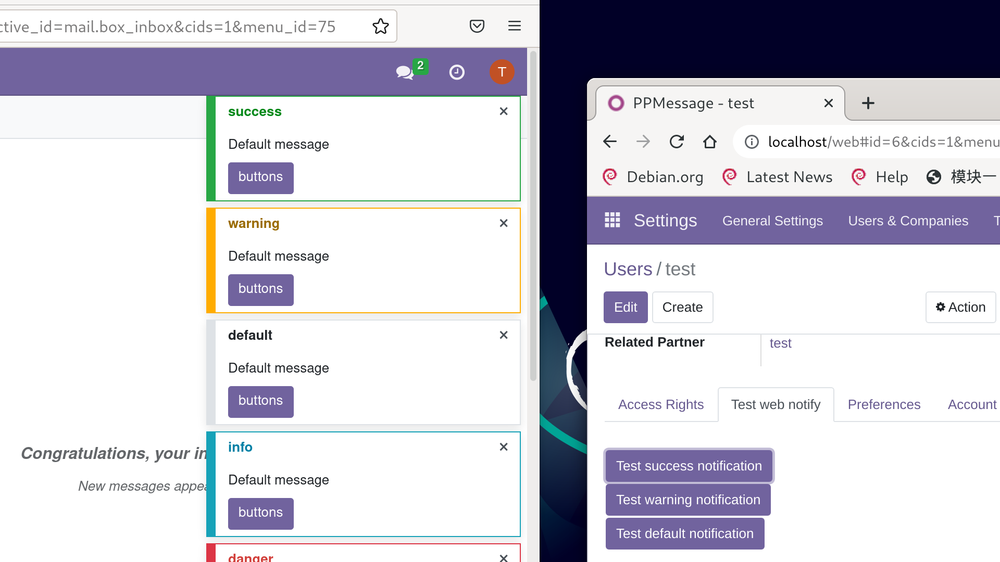

# odoo-web-notify
Send notification for Odoo internal user from python backend.

* Send notification via internal user backend bus channel/not client notification
* Receive notification with frontend bus service.
* Display notificaiton with frontend notification service.

## Test it in developer mode

Settings -> Activate the developer mode
Settings -> Users & Companies

Select a internal user

"Test web notify" in sheet page

Before click any test button, login the internal user in another browser window.

